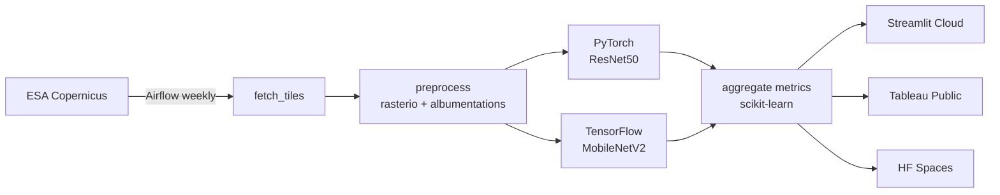

# GeoVision

> Satellite-imagery land-use classifier with change-detection, automated retraining, and live public dashboards.

**Status:** in development — Phase 0 (scaffold) complete.

## What it does

GeoVision classifies Sentinel-2 satellite tiles into 10 land-use classes (forest, urban, water, crops, etc.), then detects how a region changes between two timestamps — for example, Amazon deforestation between 2018 and 2024.

## Architecture



## Stack

PyTorch · TensorFlow · rasterio · geopandas · albumentations · OpenCV · scikit-learn · MLflow · Airflow · Streamlit · folium · Tableau Public · Docker · GitHub Actions · Hugging Face Spaces

## Quickstart (local)

> **Requires Python 3.11** — TensorFlow 2.18 does not yet support 3.13.

```bash
git clone <repo-url>
cd GeoVision
py -3.11 -m venv .venv
.venv\Scripts\activate          # Windows
# source .venv/bin/activate     # macOS / Linux
pip install -r requirements.txt
streamlit run app/streamlit_app.py
```

Training notebooks run on Google Colab — see `notebooks/`.

## Build phases

- [x] **Phase 0** — Repo scaffold
- [ ] **Phase 1** — Train PyTorch + TensorFlow on EuroSAT
- [ ] **Phase 2** — Streamlit UI (classify + Grad-CAM)
- [ ] **Phase 3** — Amazon change detection (showpiece)
- [ ] **Phase 4** — Airflow weekly pipeline
- [ ] **Phase 5** — Tableau Public dashboard
- [ ] **Phase 6** — Deploy & polish (Streamlit Cloud + HF Spaces + CI)

## Datasets

- **[EuroSAT](https://github.com/phelber/eurosat)** — 27,000 labeled Sentinel-2 patches, 13 spectral bands, 10 land-use classes. Used for training.
- **[Sentinel-2 / ESA Copernicus](https://scihub.copernicus.eu/)** — live multi-spectral imagery for change-detection.

## License

MIT
